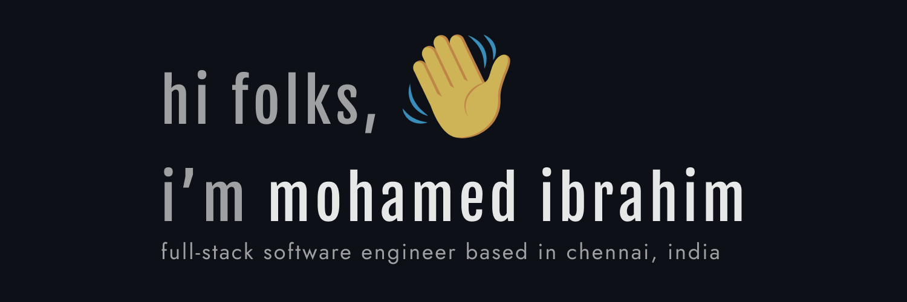

<h1 align="center">
  
</h1>

## hi there,:wave: i'm mohamed ibrahim (aka) ibu

### this is the place where i build stuff and break things :rofl:

- :seedling: I’m currently learning web related tech and system design
- :dart: I learn new stuff by building and breaking things
- 🥅 Goals: To build user facing applications that solves real world problems
- :musical_keyboard: Fun fact: I likes to jam with music DAW, listening to music and also a movie buff

### connect with me

&nbsp;&nbsp;

&nbsp;&nbsp;

&nbsp;&nbsp;

[website]: http://ibuar.duckdns.com
[twitter]: https://twitter.com/iam_ibu_ar
[instagram]: https://www.instagram.com/iam_ibu_ar
[github]: https://github.com/IbuAR
[linkedin]: https://www.linkedin.com/in/ibuar
